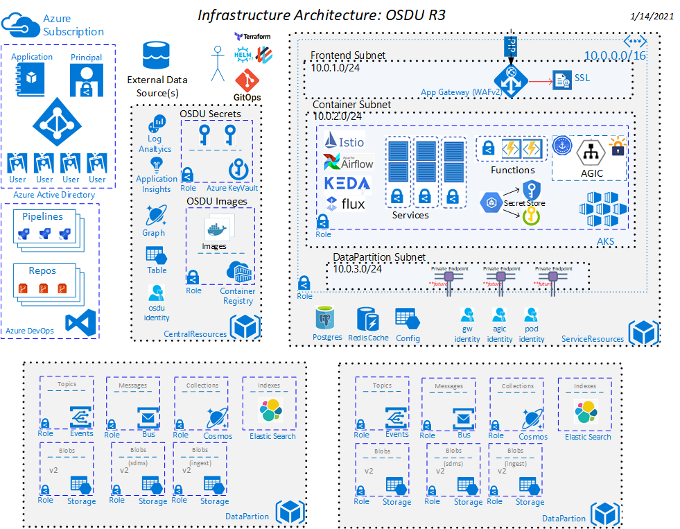

# infra-azure-provisioning

This repository contains the infrastructure as code implementation and pipelines necessary for the required infrastructure to host OSDU on Azure.

The `osdu` - R3 MVP Architecture solution template is intended to provision Managed Kubernetes resources like AKS and other core OSDU cloud managed services like Cosmos, Blob Storage and Keyvault.

## Cloud Resource Architecture




## Cost

Azure environment cost ballpark [estimate](https://tinyurl.com/y4e9s7rf). This is subject to change and is driven from the resource pricing tiers configured when the template is deployed.


## Prerequisites

1. Azure Subscription
1. Terraform and Go are locally installed.
1. Requires the use of [direnv](https://direnv.net/).
1. Install the required common tools (kubectl, helm, and terraform).  Currently uses [Terraform 0.12.29](https://releases.hashicorp.com/terraform/0.12.29/) and [GO 1.12.14](https://golang.org/dl/).


### Install the required tooling

This document assumes one is running a current version of Ubuntu. Windows users can install the Ubuntu Terminal from the Microsoft Store. The Ubuntu Terminal enables Linux command-line utilities, including bash, ssh, and git that will be useful for the following deployment. _Note: You will need the Windows Subsystem for Linux installed to use the Ubuntu Terminal on Windows_.

> Note: Terraform and Go are recommended to be installed using a [Terraform Version Manager](https://github.com/tfutils/tfenv) and a [Go Version Manager](https://github.com/stefanmaric/g)


### Install the Azure CLI

For information specific to your operating system, see the [Azure CLI install guide](https://docs.microsoft.com/en-us/cli/azure/install-azure-cli?view=azure-cli-latest). You can also use [this script](https://github.com/microsoft/bedrock/blob/master/tools/prereqs/setup_azure_cli.sh) if running on a Unix based machine.


## Create a Flux Manifest Repository

[Create an empty git repository](https://docs.microsoft.com/en-us/azure/devops/repos/git/create-new-repo?view=azure-devops) with a name that clearly signals that the repo is used for the Flux manifests. For example `k8-gitops-manifests`.

Flux requires that the git repository have at least one commit. Initialize the repo with an empty commit.

```bash
export ADO_ORGANIZATION=<organization_name>   # ie: osdu-demo
export ADO_PROJECT=<project_name>             # ie: osdu-mvp
export ADO_REPO=k8-gitops-manifests

# Initialize a Git Repository
(mkdir k8-gitops-manifests \
  && cd k8-gitops-manifests \
  && git init \
  && git commit --allow-empty -m "Initializing the Flux Manifest Repository")

# Create an ADO Repo
az repos create --name $ADO_REPO --organization https://dev.azure.com/${ADO_ORGANIZATION} --project $ADO_PROJECT -ojson
export GIT_REPO=git@ssh.dev.azure.com:v3/${ADO_ORGANIZATION}/${ADO_PROJECT}/k8-gitops-manifests

# Push the Git Repository
(cd k8-gitops-manifests \
  && git remote add origin $GIT_REPO \
  && git push -u origin --all)
```


## Provision the Common Resources

The script `common_prepare.sh` script is a _helper_ script designed to help setup some of the common things that are necessary for infrastructure.

- Ensure you are logged into the azure cli with the desired subscription set.
- Ensure you have the access to run az ad commands.


```bash
# Login to Azure CLI and ensure subscription is set to desired subscription
az login
az account set --subscription <your_subscription>
export ARM_SUBSCRIPTION_ID=$(az account show --query id -otsv)

./infra/templates/osdu-r3-mvp/common_prepare.sh
```

This results in 2 service principals being created that need an AD Admin to `grant admin consent` on.

1. osdu-mvp-{UNIQUE}-terraform
2. osdu-mvp-{UNIQUE}-principal


__Local Script Output Resources__

The script creates some local files to be used.

1. .envrc_{UNIQUE} -- This is a copy of the required environment variables for the common components.
2. .envrc -- This file is used directory by direnv and requires `direnv allow` to be run to access variables.
3. ~/.ssh/osdu_${UNIQUE}/azure-aks-gitops-ssh-key -- SSH key used by flux.
4. ~/.ssh/osdu_${UNIQUE}/azure-aks-gitops-key.pub -- SSH Public Key used by flux.
5. ~/.ssh/osdu_${UNIQUE}/azure-aks-gitops-key.passphrase -- SSH Key Passphrase used by flux.
6. ~/.ssh/osdu_${UNIQUE}/azure-aks-node-ssh-key -- SSH Key used by AKS
7. ~/.ssh/osdu_${UNIQUE}/azure-aks-node-ssh-key.pub -- SSH Public Key used by AKS
8. ~/.ssh/osdu_${UNIQUE}/azure-aks-node-ssh-key.passphrase -- SSH Key Passphrase used by AKS


__Installed Common Resources__

1. Resource Group
2. Storage Account
3. Key Vault
4. A principal to be used for Terraform _(Requires Grant Admin Approval)_
5. A principal to be used for the OSDU environment.
6. An application to be used for the OSDU environment. _(future)_
7. An application to be used for negative integration testing.

>Note: 2 Users are required to be created manually in AD for integration testing purposes manually and values stored in this Common Key Vault.


## Elastic Search Setup

Infrastructure assumes bring your own Elastic Search Instance at a version of 6.8.x and access information must be stored in the Common KeyVault.

```bash
ENDPOINT=""
USERNAME=""
PASSWORD=""
az keyvault secret set --vault-name $COMMON_VAULT --name "elastic-endpoint-dp1-demo" --value $ENDPOINT
az keyvault secret set --vault-name $COMMON_VAULT --name "elastic-username-dp1-demo" --value $USERNAME
az keyvault secret set --vault-name $COMMON_VAULT --name "elastic-password-dp1-demo" --value $PASSWORD

cat >> .envrc_${UNIQUE} << EOF

# https://cloud.elastic.co
# ------------------------------------------------------------------------------------------------------
export TF_VAR_elasticsearch_endpoint="$(az keyvault secret show --vault-name $COMMON_VAULT --id https://$COMMON_VAULT.vault.azure.net/secrets/elastic-endpoint-ado-demo --query value -otsv)"
export TF_VAR_elasticsearch_username="$(az keyvault secret show --vault-name $COMMON_VAULT --id https://$COMMON_VAULT.vault.azure.net/secrets/elastic-username-ado-demo --query value -otsv)"
export TF_VAR_elasticsearch_password="$(az keyvault secret show --vault-name $COMMON_VAULT --id https://$COMMON_VAULT.vault.azure.net/secrets/elastic-password-ado-demo --query value -otsv)"

EOF

cp .envrc_${UNIQUE} .envrc
```


## Configure Key Access in Manifest Repository

The public key of the [RSA key pair](#create-an-rsa-key-pair-for-a-deploy-key-for-the-flux-repository) previously created needs to be added as a deploy key. Note: _If you do not own the repository, you will have to fork it before proceeding_.

Use the contents of the Secret as shown above.

Next, in your Azure DevOPS Project, follow these [steps](https://docs.microsoft.com/en-us/azure/devops/repos/git/use-ssh-keys-to-authenticate?view=azure-devops&tabs=current-page#step-2--add-the-public-key-to-azure-devops-servicestfs) to add your public SSH key to your ADO environment.


## Automated Pipeline Installation

> This typically takes about 3 hours to complete.

1. Configure the Pipelines following directions [here](./docs/pipeline-setup.md).

2. Deploy the application helm charts following the directions [here]().

3. Load the data


## Manual Installation

> This typically takes about 2 hours to complete.

1. Install the Infrastructure following directions [here](./infra/templates/osdu-r3-mvp/README.md).

2. Deploy the application helm charts following the directions [here](./charts/README.md).

3. Load the data


## Developer Activities

1. To onboard new services follow the process located [here](./docs/service-onboarding.md).
